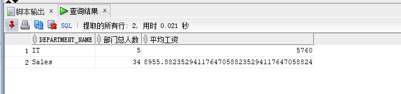
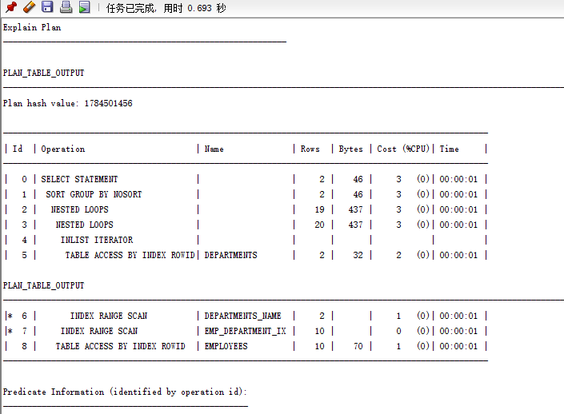
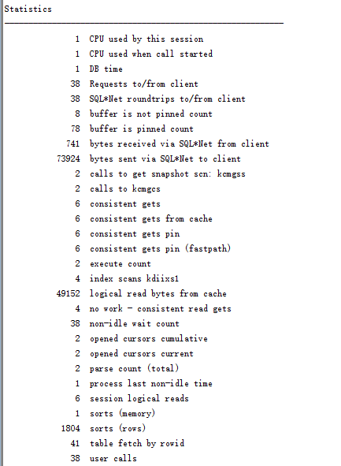
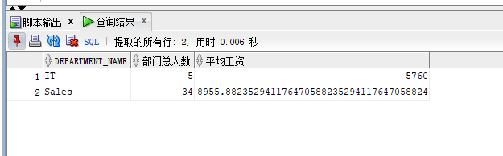
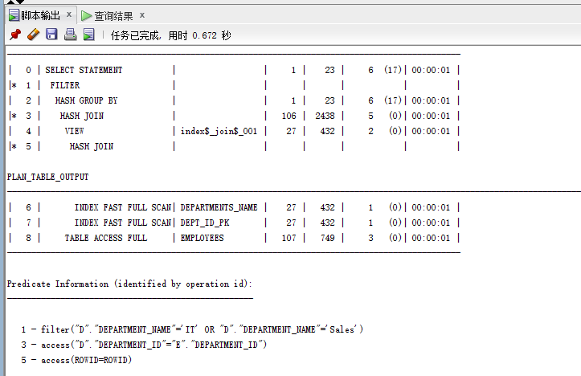
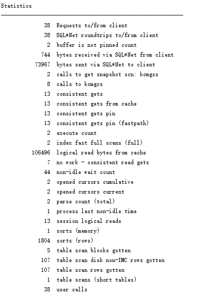
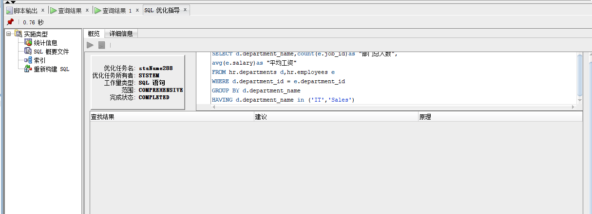
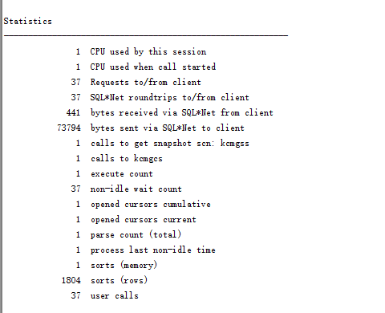
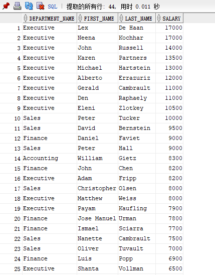
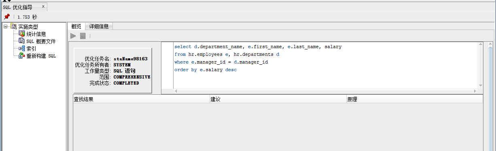

# 实验1：SQL语句的执行计划分析与优化指导
## 实验目的
  分析SQL执行计划，执行SQL语句的优化指导。理解分析SQL语句的执行计划的重要作用。
## 实验内容
- 对Oracle12c中的HR人力资源管理系统中的表进行查询与分析。

查询1：
```SQL
set autotrace on
SELECT d.department_name,count(e.job_id)as "部门总人数",
avg(e.salary)as "平均工资"
from hr.departments d,hr.employees e
where d.department_id = e.department_id
and d.department_name in ('IT','Sales')
GROUP BY d.department_name;
```
查询结果：



查询效率：





查询2：

```SQL
set autotrace on
SELECT d.department_name,count(e.job_id)as "部门总人数",
avg(e.salary)as "平均工资"
FROM hr.departments d,hr.employees e
WHERE d.department_id = e.department_id
GROUP BY d.department_name
HAVING d.department_name in ('IT','Sales');
```

查询结果：



查询效率：





结果分析：

        从查询执行完成用时可以看出，查询2的效率更高；从输出的执行计划可以看出，查询2比查询1耗费的cpu资源更多，统计信息中查询2的逻辑读次数为106496，而查询1只有49152次，查询2也比查询1多了一个索引，因此语句2的查询效率更高。

优化指导：



- 自定义查询语句

查询各部门的名称、部门经理、薪资以及平均薪资

```SQL
select d.department_name, e.first_name, e.last_name, salary 
from hr.employees e, hr.departments d
where e.manager_id = d.manager_id
order by e.salary desc
```

查询效率：



查询结果：



优化指导：



## 实验总结

```text
  本次实验，通过对相同功能的两条查询语句进行自动跟踪，然后根据统计的数据和查询所花费的事件来判断查询效率高低。我了解到了如何查看自动跟踪的数据，其中重要的是查询在磁盘或内存中的读操作，在内存中读的次数越多，缓冲区的使用命中率就越高，效率就越高。所以在查询时，应避免全局扫描，多使用索引来提高查询效率。然后还使用了sqldeveloper的sql优化指导功能，从指导给出的建议中优化我们的sql语句提高效率。

```