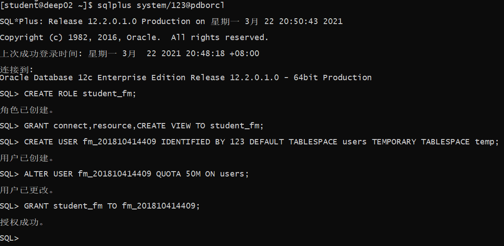
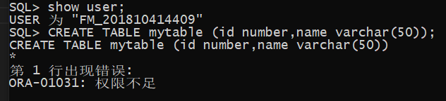
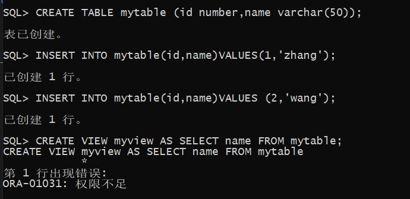
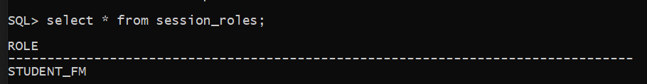
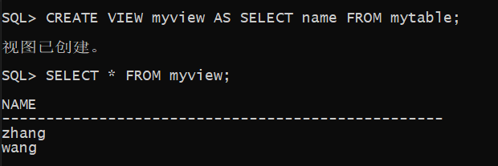

# 实验二   用户及权限管理

##  实验目的

掌握用户管理、角色管理、权根维护与分配的能力，掌握用户之间共享对象的操作技能。

## 实验内容

Oracle有一个开发者角色resource，可以创建表、过程、触发器等对象，但是不能创建视图。本训练要求：


1.  在pdborcl插接式数据中创建一个新的本地角色con_res_view，该角色包含connect和resource角色，同时也包含CREATE VIEW权限，这样任何拥有con_res_view的用户就同时拥有这三种权限。


```sql
    # 连接数据库
    sqlplus system/123@pdborcl
    # 创建角色student_fm
    CREATE ROLE student_fm;
    # 给角色赋予connect和resource角色，同时也包含CREATE VIEW权限
    GRANT connect,resource,CREATE VIEW TO student_fm;
    # 创建用户
    CREATE USER fm_201810414409 IDENTIFIED BY 123 DEFAULT TABLESPACE users TEMPORARY TABLESPACE temp;
    # 授权fm_201810414409用户访问users表空间，空间限额是50M。
    ALTER USER fm_201810414409 QUOTA 50M ON users;
    #给用户赋予角色
    GRANT student_fm TO fm_201810414409;
```



2.新用户new_user连接到pdborcl，创建表mytable和视图myview，插入数据，最后将myview的SELECT对象权限授予hr用户。

```sql
    # 使用新用户fm_201810414409链接数据库
    # 报错：ORA-01045: 用户 FM_201810414409 没有 CREATE SESSION 权限; 登录被拒绝
    sqlplus fm_201810414409/123@pdborcl
    # 登录system给新用户fm_201810414409添加CREATE SESSION，CREATE TABLE权限，然后重新登录
    GRANT CREATE SESSION,CREATE TABLE TO student_fm;


```


第一次登录失败：


第一次建表权限不足：



第一次建视图权限不足：



查看当前用户被激活的全部角色，发现connect,resource角色都没有

```sql
select * from session_roles;
```



发现是之前赋予角色的sql语句没有执行，登录system重新授权之后，重新创建视图

```sql
    # 创建视图
    CREATE VIEW myview AS SELECT name FROM mytable;
    # 查看视图
    SELECT * FROM myview;
```



3. 用户hr连接到pdborcl，查询new_user授予它的视图myview

```sql
    #登录hr用户
    sqlplus hr/123@pdborcl
    #查看视图
    SELECT * FROM fm_201810414409.myview;
```

查询结果：


4.查看数据库的使用情况


```sql
    sqlplus system/123@pdborcl

    SELECT tablespace_name,FILE_NAME,BYTES/1024/1024 MB,MAXBYTES/1024/1024 MAX_MB,autoextensible FROM dba_data_files  WHERE  tablespace_name='USERS';

    SELECT a.tablespace_name "表空间名",Total/1024/1024 "大小MB",
    free/1024/1024 "剩余MB",( total - free )/1024/1024 "使用MB",
    Round(( total - free )/ total,4)* 100 "使用率%"
    from (SELECT tablespace_name,Sum(bytes)free
            FROM   dba_free_space group  BY tablespace_name)a,
        (SELECT tablespace_name,Sum(bytes)total FROM dba_data_files
            group  BY tablespace_name)b
    where  a.tablespace_name = b.tablespace_name;
```

## 实验总结
        在本次实验中，通过创建角色，给角色分配权限、创建用户、给用户分配角色、使用新用户连接数据库、创建表、插入数据、创建视图、查询表和视图的数据等一系列操作，让我对用户管理、角色管理、权根维护与分配有了深刻的了解，同时也掌握了用户之间如何操作共享对象。
