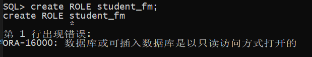

# 实验二   用户及权限管理

##  实验目的

掌握用户管理、角色管理、权根维护与分配的能力，掌握用户之间共享对象的操作技能。

## 实验内容

Oracle有一个开发者角色resource，可以创建表、过程、触发器等对象，但是不能创建视图。本训练要求：


1.  在pdborcl插接式数据中创建一个新的本地角色con_res_view，该角色包含connect和resource角色，同时也包含CREATE VIEW权限，这样任何拥有con_res_view的用户就同时拥有这三种权限。


```sql
    # 连接数据库
    sqlplus system/123@pdborcl
```

 

```sql
    # 创建角色student_fm
    CREATE ROLE student_fm;
```
 

```sql
    # 给角色赋予connect和resource角色，同时也包含CREATE VIEW权限
    GRANT connect,resource,CREATE VIEW TO student_fm;
    # 创建用户
    CREATE USER fm_201810414409 IDENTIFIED BY 123 DEFAULT TABLESPACE users TEMPORARY TABLESPACE temp;
    # 给用户分配50m表空间
    ALTER USER fm_201810414409 QUOTA 50M ON users;
    #给用户赋予角色
    GRANT student_fm TO fm_201810414409;
```

2.新用户new_user连接到pdborcl，创建表mytable和视图myview，插入数据，最后将myview的SELECT对象权限授予hr用户。

使用新用户登录：

创建mytable:

```sql
SQL> INSERT INTO mytable(id,name)VALUES(1,'zhang');
1 row created.
SQL> INSERT INTO mytable(id,name)VALUES (2,'wang');
1 row created.
SQL> CREATE VIEW myview AS SELECT name FROM mytable;
View created.
SQL> SELECT * FROM myview;
NAME
--------------------------------------------------
zhang
wang
SQL> GRANT SELECT ON myview TO hr;
Grant succeeded.
SQL>exit

```
查询mytable:

3. 用户hr连接到pdborcl，查询new_user授予它的视图myview
```sql
$ sqlplus hr/123@pdborcl
SQL> SELECT * FROM new_user.myview;
NAME
--------------------------------------------------
zhang
wang
SQL> exit
```
查询结果：

4.查看数据库的使用情况
```sql
$ sqlplus system/123@pdborcl

SQL>SELECT tablespace_name,FILE_NAME,BYTES/1024/1024 MB,MAXBYTES/1024/1024 MAX_MB,autoextensible FROM dba_data_files  WHERE  tablespace_name='USERS';

SQL>SELECT a.tablespace_name "表空间名",Total/1024/1024 "大小MB",
 free/1024/1024 "剩余MB",( total - free )/1024/1024 "使用MB",
 Round(( total - free )/ total,4)* 100 "使用率%"
 from (SELECT tablespace_name,Sum(bytes)free
        FROM   dba_free_space group  BY tablespace_name)a,
       (SELECT tablespace_name,Sum(bytes)total FROM dba_data_files
        group  BY tablespace_name)b
 where  a.tablespace_name = b.tablespace_name;
```

## 实验总结
        在本次实验中，通过创建角色，给角色分配权限，创建用户，给用户分配角色，使用新用户连接数据库、创建表，插入数据，创建视图，查询表和视图的数据等一系列操作，我对用户管理、角色管理、权根维护与分配有了深刻的了解，同时也掌握了用户之间如何操作共享对象。
