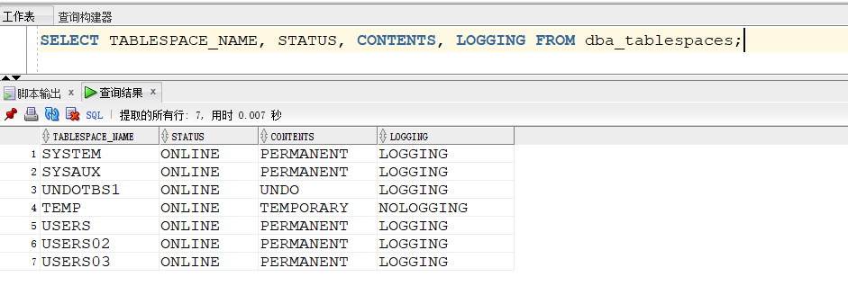
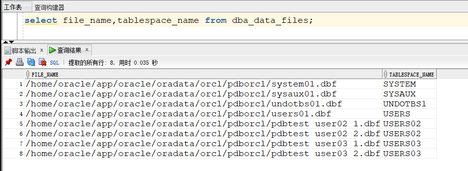
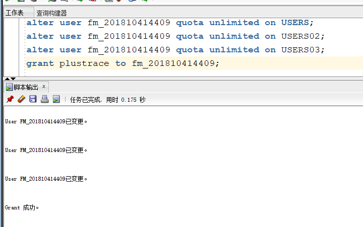
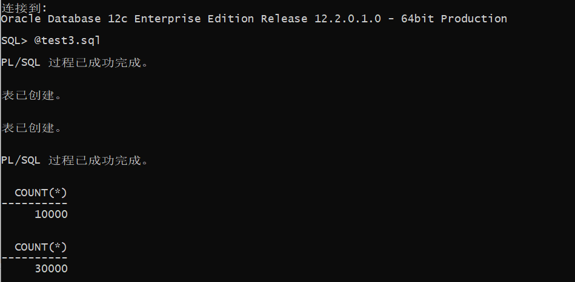
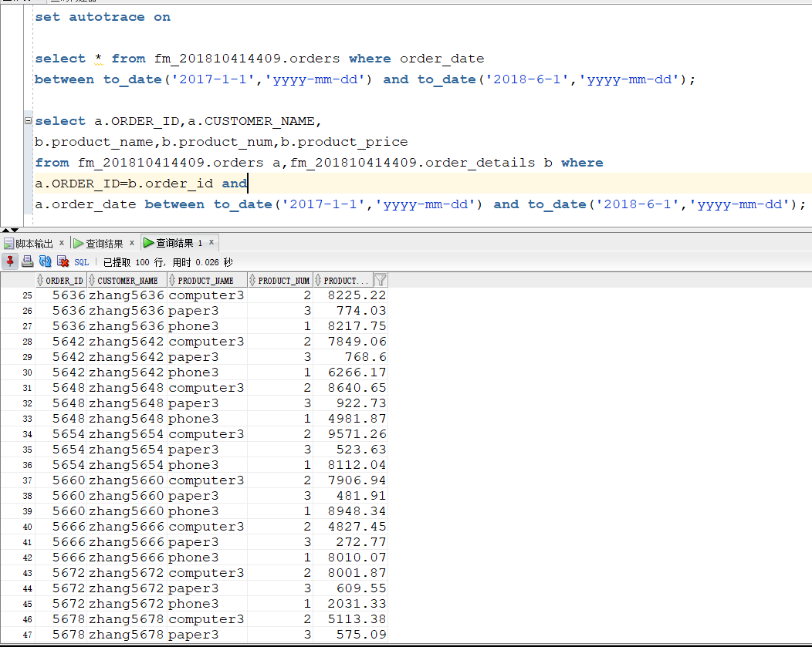
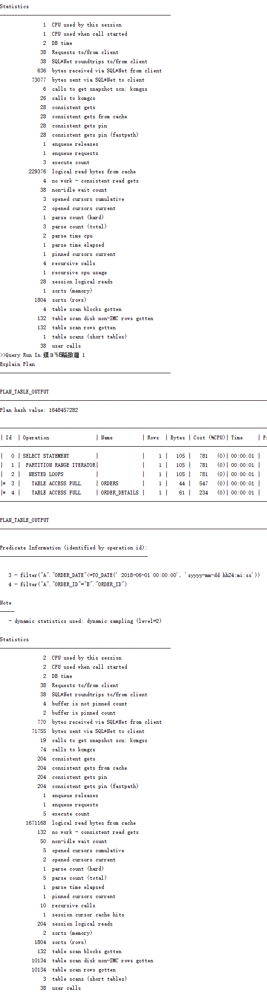

# 实验3：创建分区表

## 实验目的

掌握分区表的创建方法，掌握各种分区方式的使用场景。

## 实验内容
1. 登录system用户，查看USERS,USERS02,USERS03表空间是否存在，没有则创建对应表空间

```sql
    # 查询pdborcl数据库的所有表空间
    SELECT TABLESPACE_NAME, STATUS, CONTENTS, LOGGING FROM dba_tablespaces;
    # 查看详细数据文件
    SELECT FILE_NAME, TABLESPACE_NAME FROM dba_data_files;
```





2. 使用system用户给自己的账号(fm_201810414409)分配上述分区的使用权限和查询执行计划的权限。

```sql
    # 分配上述分区的使用权限
    alter user fm_201810414409 quota unlimited on USERS;
    alter user fm_201810414409 quota unlimited on USERS02; 
    alter user fm_201810414409 quota unlimited on USERS03;
    # 分配查询执行计划的权限
    grant plustrace to fm_201810414409;
```



3. 在主表orders和从表order_details之间建立引用分区 在fm_201810414409用户中创建两个表：orders（订单表）和order_details（订单详表），两个表通过列order_id建立主外键关联。orders表按范围分区进行存储，order_details使用引用分区进行存储。

```sql
# 创建orders表，并采用按照时间划分的范围分区，将2016年前生成的订单储存在USERS表空间中，将2017年的数据储存到USER02表空间中
CREATE TABLE orders 
(
 order_id NUMBER(10, 0) NOT NULL 
 , customer_name VARCHAR2(40 BYTE) NOT NULL 
 , customer_tel VARCHAR2(40 BYTE) NOT NULL 
 , order_date DATE NOT NULL 
 , employee_id NUMBER(6, 0) NOT NULL 
 , discount NUMBER(8, 2) DEFAULT 0 
 , trade_receivable NUMBER(8, 2) DEFAULT 0 
) 
TABLESPACE USERS 
PCTFREE 10 INITRANS 1 
STORAGE (   BUFFER_POOL DEFAULT ) 
NOCOMPRESS NOPARALLEL 
PARTITION BY RANGE (order_date) 
(
 PARTITION PARTITION_BEFORE_2016 VALUES LESS THAN (
 TO_DATE(' 2016-01-01 00:00:00', 'SYYYY-MM-DD HH24:MI:SS', 
 'NLS_CALENDAR=GREGORIAN')) 
 NOLOGGING 
 TABLESPACE USERS 
 PCTFREE 10 
 INITRANS 1 
 STORAGE 
( 
 INITIAL 8388608 
 NEXT 1048576 
 MINEXTENTS 1 
 MAXEXTENTS UNLIMITED 
 BUFFER_POOL DEFAULT 
) 
NOCOMPRESS NO INMEMORY , 
PARTITION PARTITION_BEFORE_2017 VALUES LESS THAN (
TO_DATE(' 2017-01-01 00:00:00', 'SYYYY-MM-DD HH24:MI:SS', 
'NLS_CALENDAR=GREGORIAN')) 
NOLOGGING 
TABLESPACE USERS02 
);

# 创建order_details表，并在主表orders和从表order_details之间建立引用分区
CREATE TABLE order_details 
(
id NUMBER(10, 0) NOT NULL 
, order_id NUMBER(10, 0) NOT NULL
, product_id VARCHAR2(40 BYTE) NOT NULL 
, product_num NUMBER(8, 2) NOT NULL 
, product_price NUMBER(8, 2) NOT NULL 
, CONSTRAINT order_details_fk1 FOREIGN KEY  (order_id)
REFERENCES orders  (  order_id   )
ENABLE 
) 
TABLESPACE USERS 
PCTFREE 10 INITRANS 1 
STORAGE (   BUFFER_POOL DEFAULT ) 
NOCOMPRESS NOPARALLEL
PARTITION BY REFERENCE (order_details_fk1)
(
PARTITION PARTITION_BEFORE_2016 
NOLOGGING 
TABLESPACE USERS --必须指定表空间,否则会将分区存储在用户的默认表空间中
) 
NOCOMPRESS NO INMEMORY, 
PARTITION PARTITION_BEFORE_2017 
NOLOGGING 
TABLESPACE USERS02
) 
NOCOMPRESS NO INMEMORY  
);
```

4. 运行脚本test3.sql,向表中插入数据



5.执行查询语句

```sql
set autotrace on

select * from fm_201810414409.orders where order_date
between to_date('2017-1-1','yyyy-mm-dd') and to_date('2018-6-1','yyyy-mm-dd');

select a.ORDER_ID,a.CUSTOMER_NAME,
b.product_name,b.product_num,b.product_price
from fm_201810414409.orders a,fm_201810414409.order_details b where
a.ORDER_ID=b.order_id and
a.order_date between to_date('2017-1-1','yyyy-mm-dd') and to_date('2018-6-1','yyyy-mm-dd');
```



6. 分析查询计划



```text
    从两次查询语句的跟踪信息可以看出，查询1只扫描了1张表，而查询2扫描了3张表，两次查询都进行了大量的内存读取，执行效率较高。
```
## 实验总结
```text
    本次实验使用分区表来进行数据存储与读取，通过对大量数据的查询，认识了分区表存储的优势，对分区表也有了更深的理解。通过将大量数据的表按照分区规则存储到不同的表空间，查询时到对应的分区中查找，达到降低查询数据规模的效果，从而提高数据量较大的表的查询效率。
```